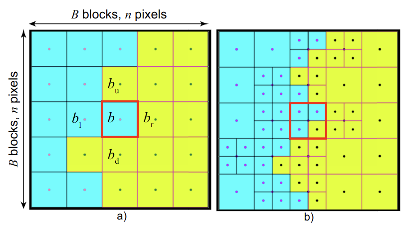

<p align="center">

  <h1 align="center">Computing Fast and Accurate Maps for Explaining Classification Models</h1>
  <p align="center">
    <a href="https://yuwang-vis.github.io/"><strong>Yu Wang</strong></a>
    ·
    <a href="https://cristigrosu.com"><strong>Cristian Grosu</strong></a>
    ·
    <a href="https://webspace.science.uu.nl/~telea001/"><strong>Alexandru Telea</strong></a>
  </p>

  <h3 align="center"> Extented version of our <a href="https://diglib.eg.org/items/1e954798-62b2-4c9d-b44f-a511b4291118"><em>EuroVA</em> paper</a></h3>

  <h2 align="center"> Submitted to <em>Computers & Graphics</em></h2>
  <div align="center">
    
  </div>


## Requirements

Make sure you have CUDA graphic card, with CUDA version >= 12.1.
<!-- please follow the requirements of [NVlabs/stylegan3](https://github.com/NVlabs/stylegan3#requirements).   -->
The code was tested with Python >= 3.10, < 3.12.
The installation steps involve the following commands:

<ol>
<li>Create a new python virtual environment and activate it.

<li>Install the requirements:

```
pip install -r requirements.txt
```


</ol>


## Check Demo

run `demo.ipynb` to check the exmaples.


## BibTeX

```bibtex
@misc{softwareGfastDBM,
	title = {Generalized FastDBM implementation source code},
	url = {https://github.com/yuwang-vis/generalized_fastDBM},
	author = {{The Authors}},
	year = {2025},
}
```
