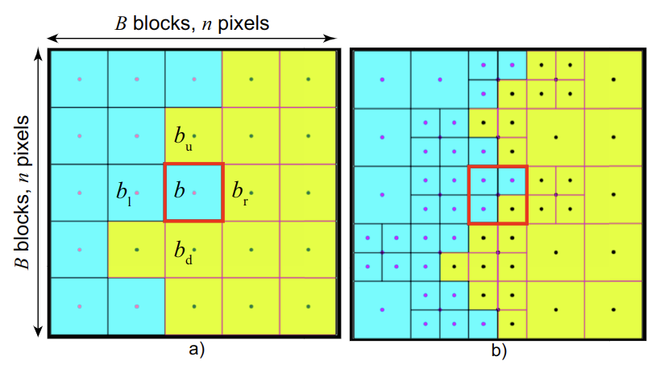

# Generalized FastDBM

Research software accompanying the paper **Computing Fast and Accurate Maps for Explaining Classification Models**.

<p align="center">
  
</p>

| Field | Details |
| --- | --- |
| Paper | [Computing Fast and Accurate Maps for Explaining Classification Models](https://doi.org/10.1016/j.cag.2025.104230) |
| Publication | *Computers & Graphics*, 2025 |
| Authors | [Yu Wang](https://yuwang-vis.github.io/), [Cristian Grosu](https://cristigrosu.com), [Alexandru Telea](https://webspace.science.uu.nl/~telea001/) |
| Related paper | Extended version of our [EuroVA paper](https://diglib.eg.org/items/1e954798-62b2-4c9d-b44f-a511b4291118) |

## What This Repository Contains

This repository implements the generalized FastDBM workflow for constructing decision maps that explain classifier behavior over a 2D projection. The code supports experiments that compare map-building strategies, evaluate runtime and accuracy trade-offs, and reproduce the examples shown in the paper.

The work is relevant to explainable AI, visual analytics, model inspection, high-dimensional data analysis, and reproducible research software.

## Repository Contents

- `demo.ipynb`: notebook entry point for checking the examples and paper workflow.
- `mapbuilder/`: decision-map construction, classifier wrappers, and neighborhood-based map-building utilities.
- `invprojection/`: inverse projection methods used by the map-building workflow.
- `expiriments/`: experiment scripts for threshold search, timing, and distance/gradient comparisons.
- `requirements.txt`: tested Python dependencies for the research workflow.
- `illustration.png`: overview figure used in the README.

## Environment

The code was tested with Python >= 3.10 and < 3.12. Some experiments require a CUDA-capable GPU with CUDA >= 12.1.

Create and activate a virtual environment, then install the dependencies:

```bash
python -m pip install -r requirements.txt
```

## Reproducing The Demo

Run the notebook from the repository root:

```bash
jupyter notebook demo.ipynb
```

The notebook demonstrates the generalized FastDBM workflow and should be the first place to check the implementation. The scripts under `expiriments/` are kept as research experiment drivers for the timing and accuracy studies used while developing the method.

## Notes For Reuse

- Run notebooks and scripts from the repository root so relative paths resolve correctly.
- GPU availability, CUDA version, and library versions can affect runtime measurements.
- The repository is organized as paper-supporting research software rather than a packaged Python library.
- The `expiriments/` directory name is retained for compatibility with the existing project layout.

## Citation

If you use this implementation, please cite:

```bibtex
@misc{softwareGfastDBM,
	title = {Generalized {FastDBM} implementation source code},
	url = {https://github.com/yuwang-vis/generalized_fastDBM},
	author = {Wang, Yu and Grosu, Cristian and Telea, Alexandru},
	year = {2025},
}

```
